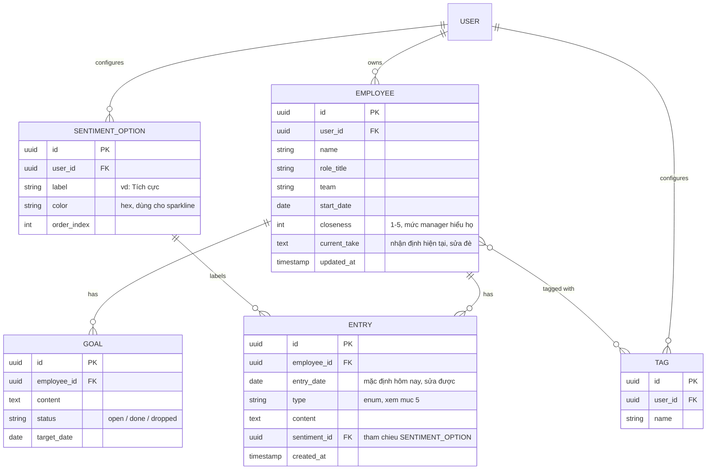
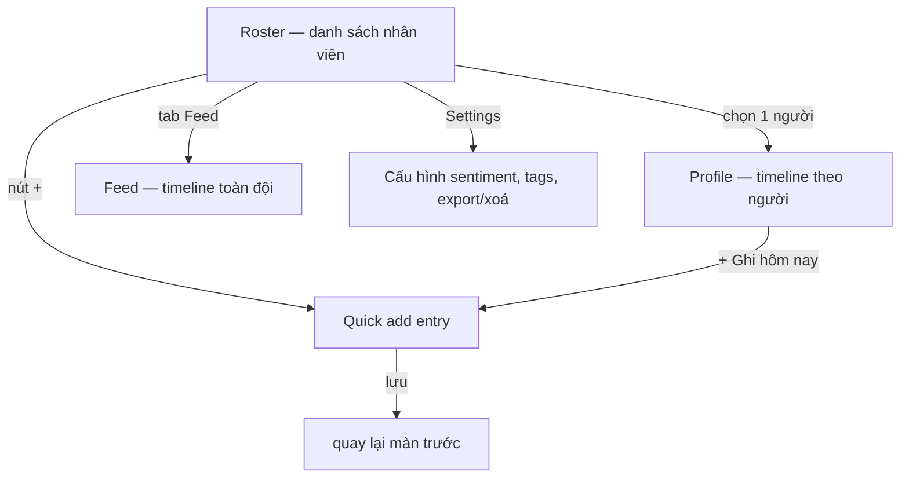

# Spec — App theo dõi & quản lý nhân viên (Manager's Team Tracker)

> Tài liệu gửi dev. Mục tiêu: build một web app private cho **một manager** ghi chú và theo dõi sự tiến hoá trong nhận định về **các nhân viên (direct reports)** của mình theo thời gian.

---

## 1. Mục tiêu & người dùng

- **Người dùng:** 1 manager, dùng hằng ngày, trên nhiều thiết bị (desktop + mobile).
- **Job chính:** mỗi ngày làm việc với nhân viên → ghi nhanh quan sát; định kỳ xem lại để chuẩn bị 1:1 và viết review mà **không bị recency bias** (chỉ nhớ chuyện gần nhất).
- **Không phải:** CRM bán hàng, không multi-user, không share. Đây là sổ tay riêng của manager.

---

## 2. Nguyên tắc cốt lõi (đọc kỹ phần này trước khi design)

### 2.1. Tách "ghi thêm" và "cập nhật nhận định"
Có 2 hành vi khác nhau, app phải support cả hai:

- **Append (timeline):** "Hôm nay An làm gì" → tạo entry mới, **không sửa quá khứ**. Đây là bằng chứng theo thời gian.
- **Revise (current take):** "Nhận định hiện tại của mình về An" → một field text **sửa đè liên tục** khi hiểu thêm.

→ Timeline append-only đứng sau làm bằng chứng cho `current_take` sửa đè được. Đây là điểm khác biệt so với app note thường (vốn chỉ có append).

### 2.2. Một dữ liệu, hai trục nhìn
Cùng một bảng `entries`, query theo 2 cách:

- **View theo người** (chiều sâu): mở 1 nhân viên → thấy toàn bộ những gì đã ghi về họ. Dùng để **chuẩn bị 1:1 / viết review**.
- **View theo thời gian** (chiều rộng): feed mọi entry của cả đội, gom theo ngày. Dùng để **nhìn lại mỗi tuần**, không quên ai.

---

## 3. Phạm vi theo phase

### MVP (đủ để dùng hằng ngày)
- CRUD nhân viên + tags + filter theo tag + search (tìm cả tên lẫn nội dung note).
- `current_take` sửa đè được + timeline append-only.
- Quick add entry: chọn người → gõ → chọn type + sentiment → xong (friction càng thấp càng tốt).
- **Sentiment cấu hình được** (xem mục 6).
- Sparkline cảm nhận theo thời gian (signature, mục 8).
- View theo người + View feed theo thời gian.
- Auth + sync nhiều thiết bị, **chỉ mình manager thấy data**.
- Export + xoá dữ liệu.

### Phase 2
- Nudge "lâu chưa 1:1" / "đang nguội" (gần đây toàn sentiment tiêu cực) → nổi lên đầu roster.
- **Review pack:** nút gom mọi win/concern/goal của 1 người trong khoảng thời gian chọn → xuất ra để dán vào form review.
- Daily review nhắc: "hôm nay bạn làm việc với ai?".

### Phase 3 (để ngỏ, chưa cần)
- AI summarize timeline 1 người → talking point trước 1:1, hoặc nháp review.
- Relationship map (ai cùng team, ai liên quan ai).

> **Lưu ý:** AI summarize **không nằm trong scope hiện tại**. Không cần thiết kế tech xoay quanh nó ở MVP.

---

## 4. Data model

**Ghi chú cho dev:**
- Mọi bảng đều có `user_id`; **row-level security theo `user_id`** (mục 9).
- `entries` là append-only về mặt UX (không cho sửa nội dung quá khứ; cho sửa thì log lại — tuỳ dev, nhưng default là không sửa).
- `sentiment_id` tham chiếu config của chính user → đừng hardcode 3 mức.

---

## 5. Entry types (cố định, manager-oriented)

| type | dùng khi |
|---|---|
| `1:1` | ghi sau buổi 1:1 định kỳ |
| `feedback` | feedback đã đưa cho nhân viên |
| `win` | việc làm tốt, thành tích |
| `concern` | điểm lo ngại / cần cải thiện |
| `note` | quan sát chung, không phân loại |

`type` cho phép lọc nhanh lúc viết review (vd: "chỉ xem các `win` của An", "tất cả `concern` tháng này"). 5 type là đủ; có thể cho config sau nếu cần, nhưng MVP để cố định.

---

## 6. Sentiment cấu hình được (manager tự chỉnh)

Yêu cầu: **không hardcode** thang sentiment. Manager tự định nghĩa bộ sentiment trong Settings.

- Mỗi sentiment option = `label` + `color` (hex) + `order_index`.
- App **ship sẵn default 3 mức**, manager sửa/thêm/bớt được:
  - 👍 Tích cực — xanh lá `#3F8F6B`
  - – Trung tính — xám `#9AA0A6`
  - 👎 Tiêu cực — đỏ đất `#C45B4C`
- Khi tạo entry → chọn 1 trong các option đang có (UI: hàng nút màu).
- `color` của option chính là màu chấm trên **sparkline** → đổi config là sparkline đổi theo.
- Edge case dev xử lý: nếu manager xoá 1 option đang được entry cũ dùng → **không xoá cứng**, đánh dấu archived và giữ màu cho entry cũ (đừng để vỡ lịch sử).

> Manager đã chốt: muốn tự config sentiment thay vì cố định 3 mức.

---

## 7. Màn hình & flow

### 7.1. Roster (home)
- Lưới card nhân viên. Mỗi card: tên, role/team, `closeness`, **sparkline cảm nhận**, dòng `current_take` rút gọn, badge "X ngày chưa 1:1" (phase 2).
- Filter bar theo tag (multi-select) + ô search.
- Nút nổi "+ Nhân viên mới".

### 7.2. Profile (View theo người)
- Header: tên, tags, `closeness` slider, ô **"Nhận định hiện tại"** to và dễ sửa (auto-save).
- Khu **Goals**: list mục tiêu/cam kết đang theo dõi, đánh dấu done được.
- Nút bự **"+ Ghi hôm nay"** (thao tác làm nhiều nhất → để nổi bật nhất).
- **Timeline** entry, mới nhất trên cùng, mỗi entry có chấm màu sentiment + badge type. Lọc được theo type và theo sentiment.

### 7.3. Feed (View theo thời gian)
- Stream tất cả entry của mọi nhân viên, **gom theo ngày** ("Tuần này / Hôm qua / …").
- Mỗi item hiện rõ: ai + type + sentiment + nội dung.
- Lọc theo người / tag / type.

### 7.4. Quick add entry
- Mở ra: con trỏ nằm sẵn ở ô nội dung; `entry_date` = hôm nay (sửa được); chọn người (nếu vào từ Roster), chọn type + sentiment bằng hàng nút.
- Tối ưu cho tốc độ: gõ xong → 1 chạm là lưu. Đây là màn dùng nhiều nhất mỗi ngày.

---

## 8. Signature — cái làm app này đáng nhớ

- **Sparkline cảm nhận:** trên mỗi card và đầu Profile, một dải chấm nhỏ tô màu theo sentiment của từng entry, xếp theo thời gian. Liếc một cái biết quan hệ đang **ấm dần hay nguội đi** — thứ app note không cho thấy.
- **Nudge hành động (phase 2):** "lâu chưa 1:1" và "đang nguội" → biến app từ kho lưu trữ thành thứ **nhắc manager hành động**.
- **Review pack (phase 2):** gom win/concern/goal theo khoảng thời gian → output dán thẳng vào form review.

---

## 9. Tech gợi ý

Vì "chỉ mình manager + nhiều thiết bị" → cần auth + cloud DB (localStorage không đủ).

- **Frontend:** React / Next.js, làm **PWA** để cài lên điện thoại, dùng như app native.
- **Backend:** **Supabase** (Postgres + Auth + Realtime, free tier) là fit nhất:
  - Sync nhiều thiết bị gần như miễn phí.
  - **Row-Level Security** theo `user_id` đảm bảo data không rò sang user khác.
  - (Firebase cũng được nếu dev quen hơn.)
- **Sparkline:** SVG tự render, đừng kéo cả thư viện chart nặng cho 1 dải chấm.

---

## 10. Bảo mật & lưu ý dữ liệu nhạy cảm

Đây là nhận xét về người thật, có thể đụng HR/pháp lý → đối xử như dữ liệu nhạy cảm:

- **Private tuyệt đối, single-user.** RLS theo `user_id`, không có đường share ở MVP.
- **Export + xoá tài khoản** để manager kiểm soát dữ liệu của mình.
- Khuyến khích trong UI (placeholder/hint): ghi **quan sát cụ thể** ("trễ deadline X 2 lần trong tháng") hơn là **nhãn cảm tính** ("lười") — công bằng hơn cho nhân viên và an toàn hơn cho manager khi cần dùng làm căn cứ review.
- Cân nhắc mã hoá at-rest cho `content` / `current_take` nếu môi trường yêu cầu cao.

---

## 11. Tóm tắt cho dev (TL;DR)

Build PWA private single-user (Supabase + RLS). 5 màn: Roster, Profile, Feed, Quick add, Settings. Một bảng `entries` query 2 trục (người / thời gian). `current_take` sửa đè + timeline append-only. Sentiment **config được** (không hardcode), màu sentiment drive sparkline. MVP không có AI. Ưu tiên tốc độ nhập liệu và xem lại theo timeline.
